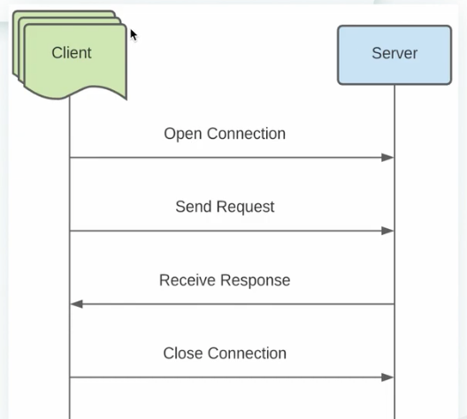
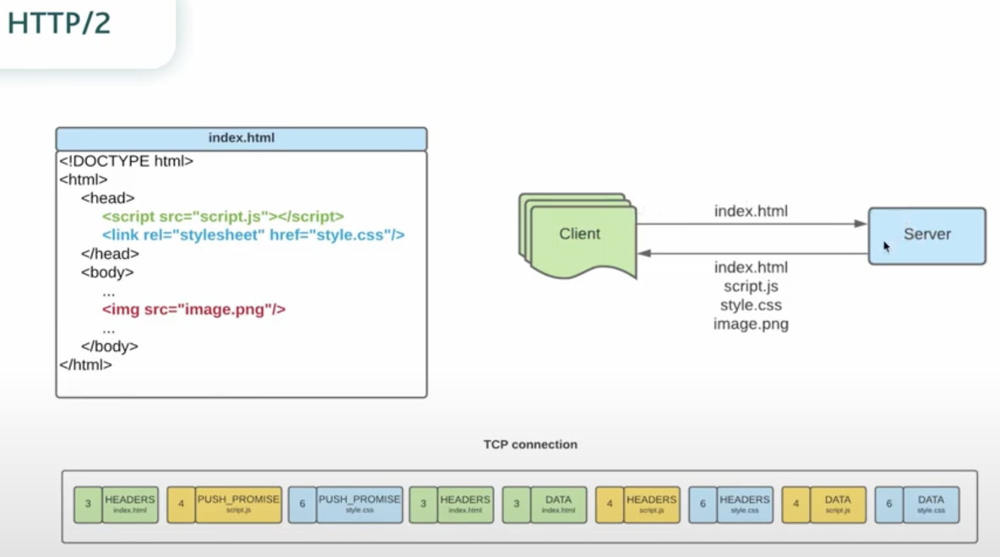

# HTTP (Hyper Text Transfer Protocol)

### HTTP/0.9 (1991)

HTTP/0.9 - первый HTTP (Hyper Text Transfer Protocol) стандарт, выпущенный в 1991 году.

Это был самый простой протокол с одним единственным HTTP-методом GET, который возвращал
HTML страницу.

### HTTP/1.0 (1996)

Название хотели поменять в этой версии, так как оно уже не соотвествовало функционалу.
Но решили оставить, так как оно уже прижилось, его не стали трогать.

Основные изменения:
- Работа с разными форматами данных: видео, изображение, текст и т.д.
- Новые HTTP-методы: POST и HEAD
- Добавились заголовки в request & responses (header)
- Коды состояний (2xx, 5xx, ...)

Один из главных недостатков HTTP/1.0 - это невозможность отправления 
более одного запроса во время одного TCP соеденения.

Плюс ко всему протокол HTTP не хранит состояний, и всю информацию
каждый раз передает в заголовке (header)

### HTTP/1.1 (1999)

Основные изменения:
- Новые HTTP-методы: PUT, PATCH, DELETE, OPTIONS
- Клиентские cookie (заголовки "Cookie" & "Set-Cookie")
- Кеширование (заголовок "Cache-Control")
- Постоянные соединения(для закрытия использовался в запросе заголовок
"Connection: close")
- Потоковая передача данных(для определения конца ответа сервера использовался заголовок "Content-Length")

HTTP/1.1 не решил полностью проблем предыдущей версии:
- Потоковая передача данных не всегда была возможна(невозможно передать в ответе заголовок Content-Length
, если сервер не может оценить объем данных)
- Проблема блокировки всей очереди запросов, если медленный или большой запрос блокировал все последующие.

### HTTP/2 (2015)

Главные отличия от HTTP/1.1:
- Бинарный вместо текстового
- Мультиплексирование (несколько асинхронных запросов через одно TCP-соединенние)
- Server Push(несколько ответов на один запрос)
- Сжатие заголовков методом HPACK
- Приоритизация запросов
- Безопасность

## HTTP (HyperText Transfer Protocol)
HTTP - протокол передачи произвольных данных прикладного уровня, который изначально
был предназначен для передачи только HTML(HyperText Markup Language) документов.

Протокол соответствует клиент-серверной архитектуре, где взаимодействие и клиента и 
веб-сервера осуществляется по стандартной схеме "request-response".

>Каждое HTTP - сообщение, независимо от того, следует оно от клиента к серверу (request)
>или от сервера к клиенту(response), состоит из трех основных частей:
> - стартовая строка
> - Заголовок (header)
> - тело сообщения (body)

Стартовая строка определяет тип сообщения, в которой указывается следующие данные(general):

HTTP метод - это название операции, которая должна быть выполнена HTTP запрососм (request):

- GET
- POST
- PUT
- DELETE
- PATCH - применяется для изменения части данных
- HEAD - просит отвечать идентично GET запросу, только без тела запроса
- CONNECT - устанавливает канал, чтбы соедениться с сервером
- OPTIONS - описывает варианты взаиодействия с целевыми ресурсами 
- TRACE - выполняет проверку, отправляя loop-back сообщение к ресурсу(ping)

### Request
Адрес (URL - Uniform Resource Locator) состоит из 4 основных вещей:
- протокол (https://, http://)
- доменное имя или IP адрес (с портом) (www.google.com, 64.233.165.105:443)
- адрес ресурса (по указанному доменному имени или IP адресу)  (/user)
- список параметров (?name=igor&age=24)

### Response
- версия протокола (HTTP/1.1, HTTP/2)
- код состояния (1xx,2xx,3xx,4xx,5xx)
- текстовое состояние

Пример:
HTTP/2      200 OK
HTTP/2      404 Not Found
HTTP/1.1    500 Internal Server Error
HTTP/1.1    503 Service Unavailable

### Status code
Status code - цифровой код ответа сервера, состоящий из трехзначного числа, первая
цифра которого означает класс состояния.

Всего существует 5 классов состояния: 1xx, 2xx, 3xx, 4xx, 5xx

1xx - инфорсация о состоянии процесса передачи

100 - continue
101 - Switching Protocols

2xx - информация об успешном принятии запроса и его обработке

200 - OK
201 - created
204 - No Content

3xx - информация о том, что необходимо выполнить запрос по другому
адресу, указанному в заголовке location (header)

301 - Moved Permanently
302 - Moved Temporarily

4xx - информация об ошибках со стороны клиента

401 - unauthorized
403 - Forbidden
404 - Not Found

5xx - информация об ошибках на стороне сервера

500 - internal Server Error
503 - Service Unavailable
504 - Gateway Timeout

### Headers
Заголовок(Header) - характеризует сообщения (body) и параметры его 
передачи в виде "header_name: header_value"

Другими словами, является метаинформацией HTTP сообщения (названия 
заголовка не чуваствительны к регистру)

### Body

Body (тело сообщения) - это непосредственно пересылаемые данные HTTP
сообщением. Отделяется от header пустой строкой.

Сами данные могут быть совершенно любые:
- HTML страницы
- JSON
- XML
- Видео
- Картинки
- Файлы

### Headers: content_type, accept

Когда мы передаем body в http запросе, мы должны указать в header какой тип данных 
мы передаем.

content_type - определяет каким типом данных яявляется body.
accept -  тип данных, который клиент ожидает получить в качестве ответа.

Оба заголовка используют [MIME](https://developer.mozilla.org/en-US/docs/Web/HTTP/Basics_of_HTTP/MIME_types) 
types ([IANA](https://www.iana.org/assignments/media-types/media-types.xhtml) media types)
 MIME type (Multipurpose Internet Extensions or MIME type) это стандарт, который
определяет природу и формат документа, файла или набор байт. Он определен и
стандартизирован в IETF's RFC 6838.

структура: type/subtype;parameter=value
пример: text/plain;charset=UTF-8

types:
- application (application/octet-stream (универсальный, стрим байтов), application/pdf, application/pkcs8, application/zip, application/json)
- audio (audio/mpeg, audio/vorbis)
- example
- font (font/woff, font/ttf, and font/otf)
- image (image/jpeg, image/png, and image/svg+xml)
- model (model/3mf and model/vrml)
- text (text/plain, text/csv, text/html)
- video (video/mp4)

Заголовок content-length указывает сколько байт в body
примиер: 38239

В стандарте HTTP/2 заголовки пишутся с маленькой буквы и перед некоторыми ставится двоеточие

### Advantage HTTP/2

**Бинарный протокол** - бинарные сообщения быстрее разбиваются автоматически, представляя
из себя фреймы (Frames) и потоки (Streams). Но в отличие от текстовых, не понятны для чтения человеком.
Переходом на бинарный формат, HTTP/2 пытается решить проблему выросшей задержки (latency - разница во времени
между началом запроса и получением ответа)

**Frames & Streams** - теперь все HTTP - сообщения делятся на фреймы(HEADERS, DATA, RST_STREAM,
PUSH_PROMISE, PRIORITY, etc)  

Коллекция таких фреймов - двунаправленный поток (Stream). Следовательно, каждый фрейм содержит
идентификатор (id) потока.

Каждый клиентский запрос использует нечетные id, а ответ от сервера - четные

**Мультиплексирование** - благодаря бинарному протоколу и представлению данных в виде фреймов и
потоков, клиент и сервер могут обмениваться сообщениями асинхронно, используя лишь одно TCP
соединение

Это также решило проблему блокировки очереди запросов, когда медленный или большой запрос
блокировал все последующие.

**Server Push** - серверная, зная, что клиент собирается запросить опрделенный ресурс, может 
отправить его сам, не дожидаясь запроса

Для этого сервер отправляет специальный фрейм PUSH_PROMISE с таким же id, что и запрос клиента.

Пример загрузки данных по HTTP/1.1

Пример загрузки данных по HTTP/2

### сжатие заголовков методом HPACK

Формат сжатия HTTP/2 заголовков HPACK состоит из трех основных частей:
1. Статическая таблица - общая для всех TCP соединений и содержит 61 часто используемые
заголовки, которые можно найти в документации протокола.
2. Динамическая таблица - создается для каждого TCP соединения и содержит используемые
заголовки во время обмена сообщениями (ограниченного размера)
3. Сжатие заголовков алгоритмом Хаффмана, который показывает хороший алгоритм сжатия.

**Приоритизация потоков** - клиент может назначить приоритет потоку (stream), добавив
соответсвующую информацию во фрейме HEADERS (число  от 1 до 256), либо обновить уже 
созданный поток с помощью фреймам PRIORITY.

>Также каждому потоку может быть дана явная зависимость от другого потока, что вместе
>с приоритетами представляет собой "дерево приоритетов" 

**Безопасность** - большинство клиентов(браузеров) поддерживают HTTP/2 только если
он используется поверх протокола TLS (т.е. должен использоваться протокол HTTPS)

В свою очередь, спецификация не требует данного ограничения

>Сокращение числа подключений ввиду перечисленных преимуществ
> HTTP/2 приводит к сокращению затратных "рукопожатий TLS" (TLS handshake)

С.СИНГХ книга шифров

