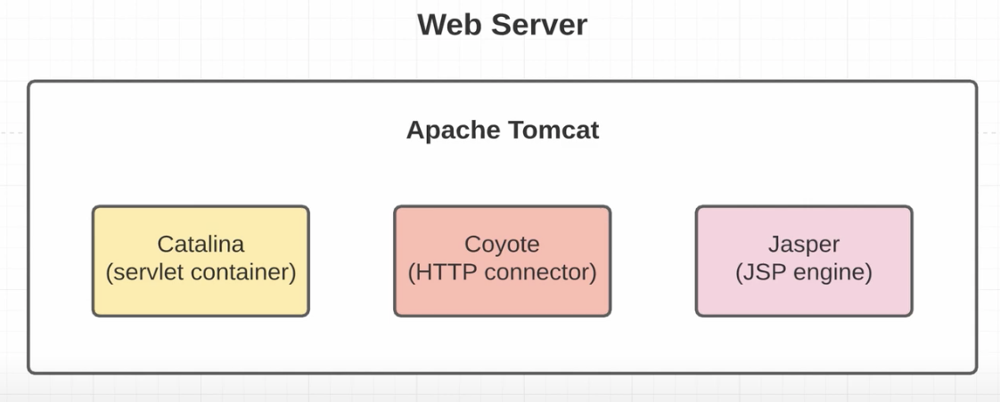
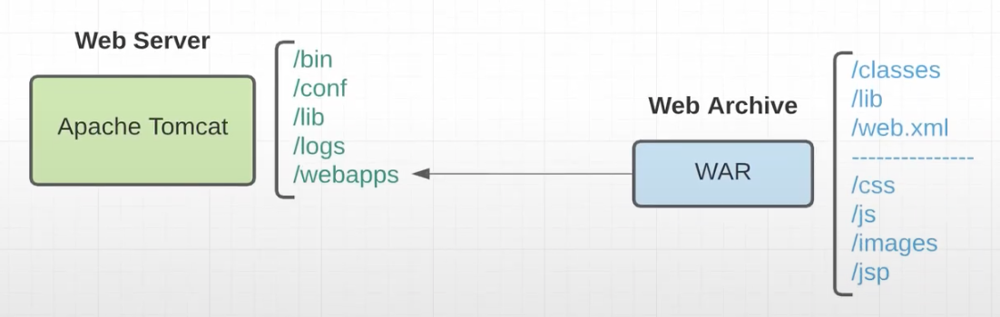
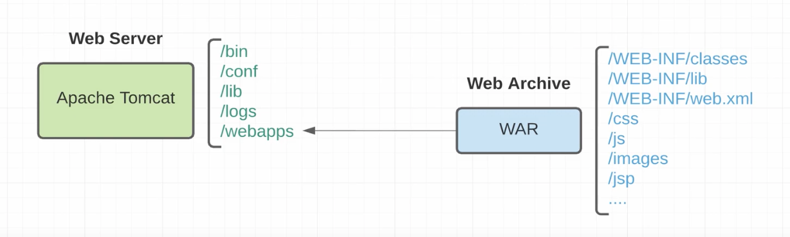

# Apache Tomcat ([source](https://github.com/apache/tomcat))

web server - умеет обрабатывать http запросы и генерировать ответ

Catalina(servlet container) - контейнер сервлето tomcat, каталина реализует sun microsystems' specification
и JavaServer Pages.

Coyote (HTTP connector) - это компонент Connector для Tomcat, который поддерживает протоколы HTTP 1.1 и 2 в качестве
веб-сервера. Это позволяет Catalina, номинально являющемуся Java-сервлетом или контейнером JSP, 
также действовать как простой веб-сервер, который обслуживает локальные файлы как HTTP-документы.

Jasper (JSP engine) - это JSP-engine Tomcat. Jasper анализирует файлы JSP, чтобы скомпилировать их в код Java
в виде сервлетов (это может обрабатывать Catalina). Во время выполнения Jasper обнаруживает 
изменения в файлах JSP и перекомпилирует их.

## Structure apache tomcat

- **/bin** - Скрипты запуска, выключения и другие. Файлы * .sh (для систем Unix) являются функциональными 
дубликатами файлов * .bat (для систем Windows). Поскольку в командной строке Win32 отсутствуют определенные
функции, здесь есть несколько дополнительных файлов.
- **/conf** - Файлы конфигурации и связанные с ними DTD. Самый важный файл здесь - server.xml. Это основной
файл конфигурации для контейнера.
- **/lib** - собраны jar файлы необходимые apache tomcat для работы(зависимости).
- **/logs** - файлы журналов находятся здесь по умолчанию.
- **/webapps** - вот куда идут ваши веб-приложения.

**tomcat-users.xml** - в нем можно добавить пользователя для доступа к /manager/html.
после этого можно зайти на http://machine_ip/manager/html для управления приложением: деплой, перезагрузка, 
остановка и т.д. Этот способ устарел, так как это можно сделать вручную, положив war архив в деррикторию webapps.

**server.xml** - основной конфигурационный файл. Можно менять порт, версию http, tomcatThreadPool, connectionTimeout
и многое другое. 

В папке webapps уже есть приложения: docs, examples, manager, host-manager, ROOT. Если задеплоить war в папку с 
названием ROOT, то приложение будет доступно по '/' пути. Другие приложения будут доступны по названию папки:
- machine_ip:port/      <--ROOT
- machine_ip:port/docs
- machine_ip:port/examples
- machine_ip:port/manager
- machine_ip:port/host-manager

В папке bin скрипты для управлением apache tomcat. startup.sh - запускает сервер, shutdown.sh - останавливает сервер.

Структура папок в war архиве сильно отличается от структуры jar архива. В jar лежать только наши скомпилированные файлы,
а в war лежать не только классы. Главная папка - WEB-INF.

- /WEB-INF/classes - здесь находятся скомпилированные классы, то есть то что лежит в обычном jar архиве.
- /WEB-INF/lib - здесь находятся зависимости.
- /WEB-INF/web.xml - фаил с конфигурацией
- /css-----------|
- /js------------|
- /images--------|----папки, которые видны браузеру
- /jsp-----------|

