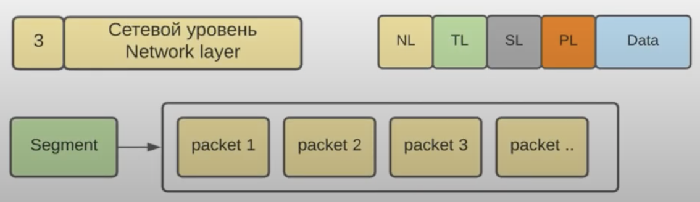

#Networks

В зависимости от территориальной принадлежности и размеров
выделаяют следующие типы сетей:

- Персональные
- Локальные
- Городские
- Глобальные

**PAN(Personal Area Network)** - сети, которые объединяют персональные
электронные устройства, такие как ноутбук, смартфон и т.д.

Особенности: небольшой радиус действия, малое количество узлов, простота
подключения

**LAN(Local Area Network)** - это сети, которые объединяют компьютеры и различные
стевые устройства в рамках одного здания или группы рядом стоящими зданиями

Особенности: низкая стоимость и высокая скорость передачи информации

**MAN(Metropolitan Area Network)** - это сети, которые объединяют узлы(сети) в рамках 
города или региона.

Особенности: низкая стоимость передачи данных, большой размер сети

**WAN(Wide Area Network)** - сети, которые охватывают большие географические регионы(города,
 страны и целые континенты). Интерет - это глобальная сеть.
 
Особенности: больщая протяженность каналов связи, огромное количество узлов(сетей)

## Модель OSI(Open System Interconnection model)

OSI - эталонная модель взаимодействия открытых систем, которая лежжит в основе стандартов
всех компьютерных сетей.

Модель разработна международной организацией по стандартизации OSI(International Organization 
for Standardization) 

Поэтому полное название ISO/OSI

Она описывает:
- Уровни архитектуры компьютерной сети
- Вертикальные связи разных уровней одной системы
- Горизонтальные связи одинаковых уровней разных систем

состоит из 7 уровней:

Application layer - обеспечивает связь между приложениями

Единственный уровень, который взаимодействует напрямую с данными от пользователя

Протоколы прикладного уровня: HTTP, FTP, SMTP, SSH и многие другие

Presentation layer - основная задача этого уровня заключается в преобразовании передаваемых
данных в взаимно соглачованные форматы, шифровании, компрессии данных и обратные этим процессам -
дешифрование, декомпрессия и т.д.

Протоколы уровня представления: TLS, SSL

Session layer - ответственный за открытие и закрытие соединений(сессия - это и есть время между 
открытием и закрытием соединения между устройствами)

На практике протоколы сеансового уровня не выделяются, их работу выполняют протоколы верхних
уровней.

Transport layer - разбивает поток данных на сегменты для передачи на сетевой уровень (и наоборот, склеивает
пакеты из сетевого уровня в сегменты), добавляя свой заголовок к каждому сегменту (порты приложений), а также
выполняет процедуру для обеспечения необходимого уровня надежности передачи информации.

Основные протоколы транспортного уровня: TCP, UDP

Порт (TCP, UDP) -  это некоторое число в диапозонеот 1 до 65535, которое сопоставляется с конкретным приложение
(протокол прикладного уровня), при помощи которого осуществляется доступ к сети

Появляется на одной машине запускать несколько приложений с доступом в сеть по шаблону IP:port
Например: 172.168.9.2:8081, 172.168.9.2:8085

Network layer - главной задачей является разбиение сегмнтов с предыдущего уровня на пакеты данных(и наоборот,
пакеты собирать в сегменты для отправки на следующий уровень), а также доставка этих пакетов данных между 
разными сетями.

Название основоного протокола сетевого уровня - IP (internet Protocol)

Для передачи данных из одной сети в другую вводится своя система адресации(сетевой адрес IPv4 или IPv6) и 
реализуется механизм маршрутизации (определение пути передачи данных между сетями).

IPv4 пакет:

1. Version - версия (IPv4, IPv6)
2. IHL (Internet Header Length) - размер заголовка (введен из-за поля Options, которое сейчас не 
используется) и равен 20 байтам.
3. TOS (Type of Service) - состоит из двух полей: DSCP и ECN
4. Total Length - полный размер всего IP пакета (максимальный размер 65535 байт)

5. Identification - идентификатор пакета, который используется в случае его фрагментации на куски
(у всех кусков будет то же значение)
6. Flags - используется для контроля над фрагментацией пакетов(где начинается фрагментация пакета,
где заканивается и др).
7. Fragmentation Offset - говорит на сколько байт нужно выполнить смещение от 0 в случае 
фрагментации пакета  

Фрагментация пакета

8. TTL - время жизни пакета (чтобы не блуждал по сети до бесконечности). Определяет максимальное
число узлов, через которое пакет может пройти перед тем, как будет уничтожен. 
9. Protocol - указывается протокол верхнего уровня, например, в случае TCP - это 00000110(6), 
в случае UDP - 00010001 (17)
10. Header checksum - проверяет только целостность заголовка (протокол IP не умеет проверять 
целостность данных, это делают протоколы верхних уровней)

11. Source IP Address - IP адрес источника (нужен только принимающей стороне, чтбы знать куда 
слать ответ)
12. Destination IP Address - IP адрес назначения(маршрутизаторы смотрят именно на это поле при
принятии решения, куда направить пакет)
13. Options - не используется

Data link layer - разбивает пакеты с предыдущего уровня на кадры (frame) данных (и наоборот, 
кадры преобразуются в пакеты) и производится доставка кадро в пределах одной сети, осуществляется
проверка доступности среды передачи и контроль ошибок передачи.

Основные протоколы транспортного уровня: Ethernet, PPP, PPPoE

На этом уровне вводится понятие MAC-адоес - уникальный аппаратный адрес (идентификатор), который 
прошит в каждой сетевой карте устройства.

Представляет собой 48-битное число, которое разбито на 6 часте(октетов), разделенных между собой
двоеточием.

>Комутатор в отличии маршрутизатора умееет передавать данные только в пределах одной сети. 
>Маршрутизаторы работают на сеевом уровне.

Frame представляет из себя последовательность упорядоченных байт информации и включает в себя:
- преамбулу (Preamble) для синъронизации кадров
- начальный ограничитель (SD) для указания начало/конца кадра
- MAC-адрес отправителя
- MAC-адрес получателя
- идентификатор протокола верхнего уровня (Т)
- данные (Data) - обычно представляющие собой данные пакета из сетевого уровня
- контрольную сумму (FSC) для проверки целостности кадра

**Physical layer** - реализован аппаратно и определяет методы передачи битов данных по физическим 
каналам.

Описывает такие характеристики как вид среды передачи(кабель и радиоэфир), топологии сети и 
другие.

Доменное имя (host name) - представляет из себя понятный и хоррошо запоминающийся человеку текст,
например: google.com, facebook.com.

С каждым доменным именем связывается один или несколько IP адресов, и в свою очередь, с каждым
IP адресом может быть связано одно или несколько доменных имен.

Существует два способа реализации доменных имен.

- Первый устаревший способ реализации системы доменных имен был основан на использовании файла 
hosts, который представляет из себя обычный текстовый файл, где хранятся пары соответсвий IP
адресов и доменных имен. Windows - C:\Windows\system32\drivers\etc\hosts, UNIX - /etc/hosts

- Воторой способ реализации доменных имен основан на использовании службы DNS.
DNS (Domain Name System) - это распределенныая система, в котороой информация о доменах хранится
на большом количестве связанных между собой DNS - серверов.

DNS рпедполагает, что все компьютеры в сети разделяются на логические группы - домены

При этом доменные имена образуют иерархическую структуру, т.к. одни домены могут являться частью
других.

В этой связи выделяют домены первого уровня, второго и т.д.

Обычно DNS используется для преобразования доменных имен в IP адреса - это назывется прямое 
перобразование

Обратное преобразование - по известному IP адресу получить доменное имя

Для обратного преобразования в DNS используется обратные зоны, которые создаются и настраиваются 
независимо от прямых

Созданием и поддержанием имен в доменах вернего уровня(com, org, ru и др.) занимается специальнае -
компании регистраторы доменных имен(RU-CENTER)

Сами домены верхнего уровня создаются и поддерживаются на уровне корневого домена.

Этим занимается международная организация ICANN(Internet Corporate for Assigned and Numbers)

## Основные форматы данных

### XML

работа с xml состоит из нескольких частей:
- написание xml, который состоит всего лищь из теги и атрибуты.
- для того чтобы ограничивать набор тэгов и атрибутов сделали валидаторы: DTD(устаревший), XSD
- для того, чтобы распарсить xml в java есть основные парсеры: DOM, SAX, StAX, XPath

тег может содержать текстовый узел, либо теги, либо быть пустым <tag/>
структура exampleXMLHttpRequest.xml

В xml есть namespace, который похожи на package в java. Xml могут называться одинаково, но тольу если namespace у них разные.

### HTML

 
