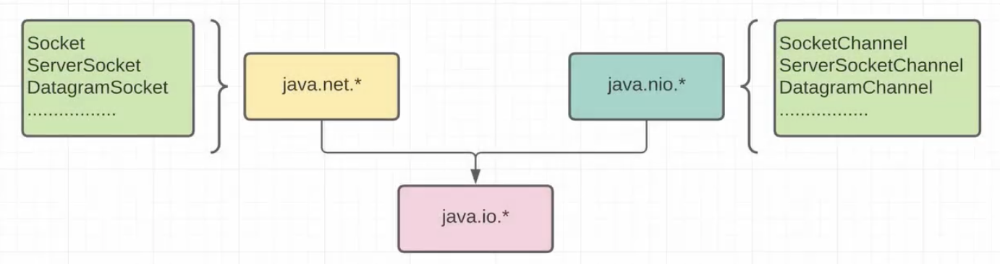
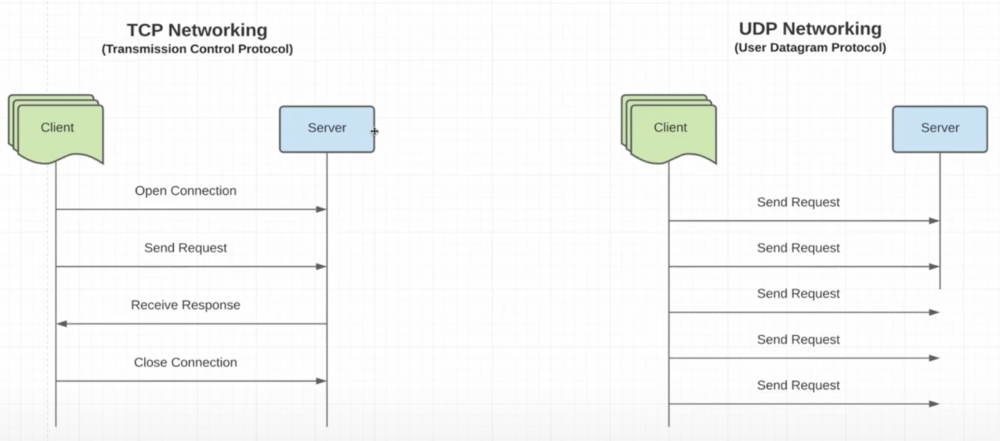
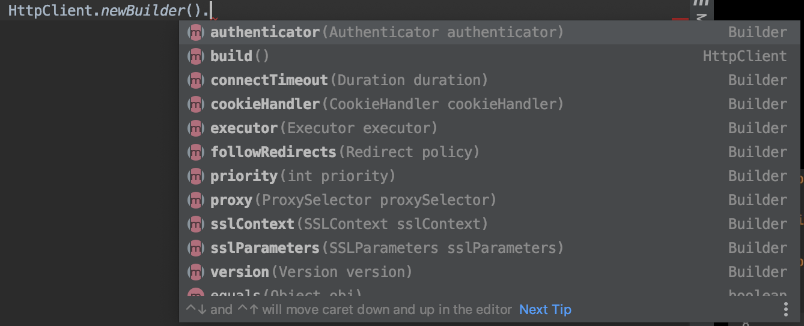
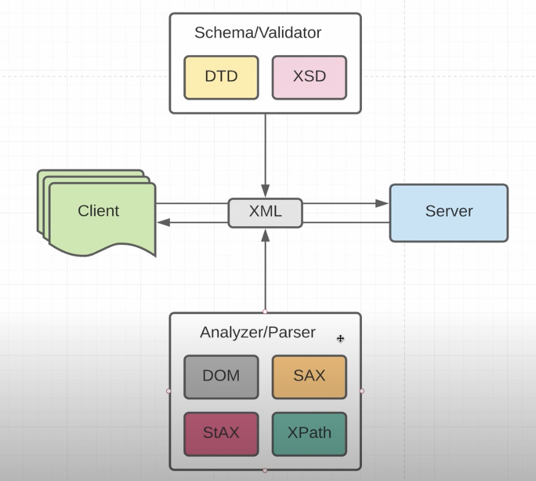
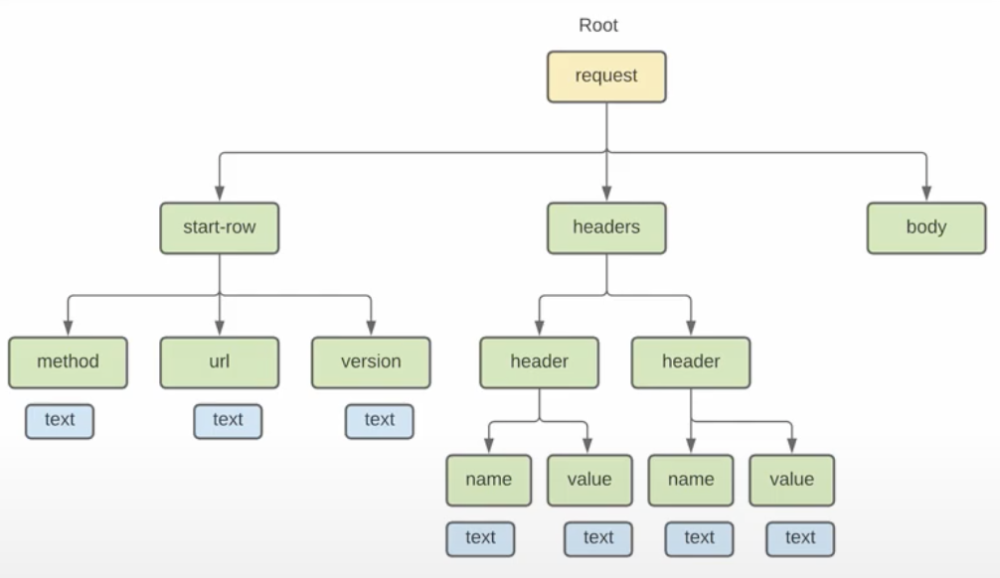
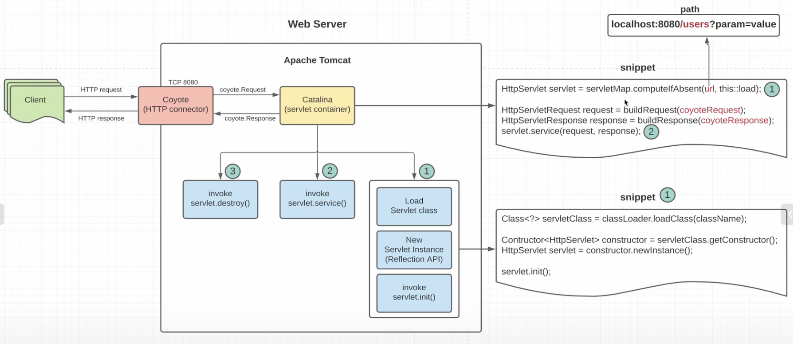

# Networks in JAVA

##java.net.*

Socket, ServerSocket - работатет напрямую черзе протокол TCP
DatagramSocket - работатет черзе протокол UDP

java.nio по умолчанию работает в блокирующем режиме, но поддерживает
не блокирующий режим

##java.nio.* (nonblocking input output)

SocketChannel, ServerSocketChannel - работатет напрямую черзе протокол TCP
DatagramSocketChannel - работатет черзе протокол UDP

## TCP and UDP interaction

На машине tcp и udp порт может совпадать у сервера, так как компьютер поразному
их обрабатывает.

С классом java.net.URL удобноработатб только при get запросов, как только нам 
нужно передать тело запроса он становится неудобным  

### HttpClient

## Основные форматы данных

### XML

работа с xml состоит из нескольких частей:
- написание xml, который состоит всего лищь из теги и атрибуты.
- для того чтобы ограничивать набор тэгов и атрибутов сделали валидаторы: DTD(устаревший), XSD
- для того, чтобы распарсить xml в java есть основные парсеры: DOM, SAX, StAX, XPath

тег может содержать текстовый узел, либо теги, либо быть пустым <tag/>
структура exampleXMLHttpRequest.xml

В xml есть namespace, который похожи на package в java. Xml могут называться одинаково, но тольу если namespace у них разные.

### HTML

### JSON

MIME type для json это application/json

### Web Server

### Servlet livecycle

