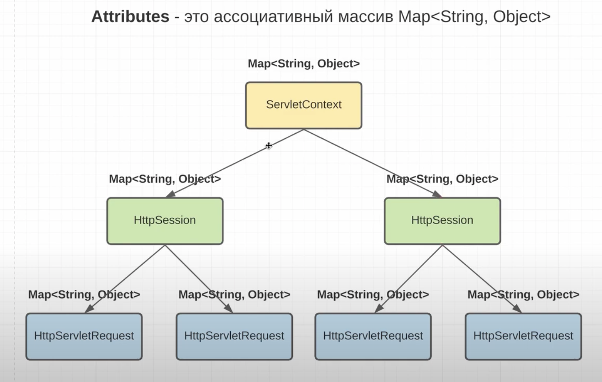
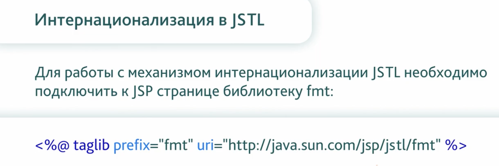

#Servlets Guid


## Debug mode

1) Start Tomcat in debug mode
   $TOMCAT_HOME/bin/catalina.sh jpda run

   By default JPDA_ADDRESS is defined as "localhost:8000" in catalina.sh
   Change to a different port as need

2) In IntelliJ IDE
   Click Run > Edit Configurations
   Click + icon on the top-left toolbar
   Click Remote
   Enter a name you want in Name input box
   Enter 8000 in Port input box under Settings section

3) Click Apply, then OK
4) Run > Debug..., Click the configuration you just created

## Livecycle servlet

SerletContext это глобальный объект, он для всех сервлетов один. 

создадим сервлет:

```java
public class FirstServlet extends HttpServlet {

    @Override
    public void init(ServletConfig config) throws ServletException {
        super.init(config);
    }

    @Override
    protected void doGet(HttpServletRequest req, HttpServletResponse resp) throws ServletException, IOException {
        resp.setContentType("text/html");
 
        try (var writer = resp.getWriter()) {
            writer.write("<h1>Hello, World</h1>");
        }
    }

    @Override
    public void destroy() {
        super.destroy();
    }
}
```

Есть два способа мапинга урла на сервлет:

- старый способ через web.xml конфиг

```xml
<?xml version="1.0" encoding="UTF-8" ?>
<web-app xmlns="http://xmlns.jcp.org/xml/ns/javaee"
         xmlns:xsi="http://www.w3.org/2001/XMLSchema-instance"
         xsi:schemaLocation="http://xmlns.jcp.org/xml/ns/javaee
                      http://xmlns.jcp.org/xml/ns/javaee/web-app_4_0.xsd"
         version="4.0">

    <servlet>
        <servlet-name>FirstServlet</servlet-name>
        <servlet-class>ru.lid.servlet.servlet.FirstServlet</servlet-class>
    </servlet>
    <servlet-mapping>
        <servlet-name>FirstServlet</servlet-name>
        <url-pattern>/first</url-pattern>
    </servlet-mapping>
</web-app>
```

- новый, который является предпочтительней, через аннотацию:

```java
@WebServlet("/first")
public class FirstServlet extends HttpServlet {
//    ...
}
```

## Architecture of WebApp


## Download from service

Для того-чтобы реализовать скачивание, надо передать http header - [Content-Disposition](https://developer.mozilla.org/en-US/docs/Web/HTTP/Headers/Content-Disposition).

```
Content-Disposition: inline
Content-Disposition: attachment
Content-Disposition: attachment; filename="filename.jpg"
Content-Disposition: form-data; name="fieldName"
Content-Disposition: form-data; name="fieldName"; filename="filename.jpg"
```

```java
@WebServlet("/download")
public class DownloadServlet extends HttpServlet {

    @Override
    protected void doGet(HttpServletRequest req, HttpServletResponse resp) throws ServletException, IOException {
        resp.setHeader("Content-Disposition", "attachment; filename=\"testFile.txt\"");
        resp.setContentType("text/plain");
        resp.setCharacterEncoding(StandardCharsets.UTF_8.name());

        try (var outputStream = resp.getOutputStream();
            var resourceAsStream = DownloadServlet.class.getClassLoader().getResourceAsStream("testFile.txt")) {
            outputStream.write(resourceAsStream.readAllBytes());
        }
    }
}
```

## MVC


## Cookies


Cookie (англ. cookie, букв. — «печенье») — небольшой фрагмент данных, отправленный веб-сервером и хранимый на компьютере 
пользователя. Веб-клиент (обычно веб-браузер) всякий раз при попытке открыть страницу соответствующего сайта пересылает 
этот фрагмент данных веб-серверу в составе HTTP-запроса. Применяется для сохранения данных на стороне пользователя, на 
практике обычно используется для:
- аутентификации пользователя;
- хранения персональных предпочтений и настроек пользователя;
- отслеживания состояния сеанса доступа пользователя;
- сведения статистики о пользователях.

Cookie легко перехватить и подменить (например, для получения доступа к учётной записи), если пользователь использует 
нешифрованное соединение с сервером. В группе риска пользователи, выходящие в интернет при помощи публичных точек доступа 
Wi-Fi и не использующие при этом таких механизмов, как SSL и TLS. Шифрование позволяет также решить и другие проблемы, 
связанные с безопасностью передаваемых данных.

Взаимодействие с cookie:


можно двумя способами получить cookie:
- ```var cookies = req.getHeader("cookie");``` - нужно самому парсить cookie
- ```var cookies = req.getCookies();``` - получаем распарсенные cookie. Если cookie отсутствуют, то вернется null,
поэтому надо писать null-safe code

Создание Cookie и установка параметров для него:


Первое выполнение запроса - сервер устанавливает cookie:


Второй запрос - в запрос клента будут вклюсаться cookie:


## Session

Определение «сессия» (англ. Session), или «HTTP сессия», варьируется, особенно применительно к поисковым системам.
Обычно под сессией понимается «последовательность запросов, сделанных конечным клиентом (веб-браузером, приложением, краулером и др.)
во время посещения определённого хоста». В широком смысле слова — это все запросы, сделанные пользователем в конкретный период времени.

Сессия создаётся при первом запросе к хосту (серверу). При обращении клиента хост генерирует идентификатор сессии, который затем
используется клиентом при каждом обращении к хосту пока существует сессия. На стороне хоста может быть реализована различная логика
разрыва сессии: например, сохранение сессии долговременно, удаление сессии при завершении сеанса, открытие новой сессии при каждом
переходе с нового источника, открытие новой сессии при идентификации (логине), удаление сессии через промежуток времени и др.
Если клиент обращается к хосту с использованием не активного (например, удалённого или помеченного как не активный, устаревший)
идентификатора сессии, то создаётся новая сессия. На стороне клиента разрыв HTTP сессии реализуется как правило через удаление
идентификатора сессии. В разных клиентах это реализуется по-разному. В веб-браузерах это осуществляется в основном через обновление
или удаление файлов Cookies.


Стандартная session в tomcat реализована через cookie. Tomcat создает JSESSIONID, наличие которого является свидетельством открытой сессии.
В основном работа с session заключается в установке атрибутов для session в виде объектов, например, объекта User, для того чтобы ассоциировать
session с User.

Session можно задавать любой аттрибут. Для того чтобы установить аттрибут session, нужно указать имя аттрибута и передать любой объект, котрый мы
хотим ассоциировать с данной сессией.

```java
public class SessionServlet extends HttpServlet {
   protected void doGet(HttpServletRequest req, HttpServletResponse resp) throws ServletException, IOException {
      var session = req.getSession();
      var user = (UserDto) session.getAttribute(USER);

      if (user == null) { //первыый запрос от пользователя
         // обычно пользователь устанавливается один раз на странице login приложения по username и password
         user = UserDto.builder()
                 .id(25L)
                 .mail("test@gmail.com")
                 .build();
         session.setAttribute(USER, user);
      }
   }
}
```

Аттрибуты есть не только у session:



## Перенаправление


Важно понимать, что когда мы закрываем outputStream, то client сразу получает ответ,
и больше мы не сможем послать что-то клиенту в этом запросе.

Мы можем, что-то записать в outputStream, до forward, незакрывая поток вызвать forward. В новом servlet
можем дописать что-то и закрыть поток.

Мы можем, что-то записать в outputStream, до include, незакрывая поток вызвать include. В новом servlet
можем дописать что-то, также не закрывать поток, после запрос вернется обратно, где мы можем опять что-нибудь
дописать в outputStream.

Headers должны устанавливать в servlet, который отдает ответ серверу. 

## JSP (Java Servlet Pages) Жизненный цикл

JSP старая технология, которая встречается в основном в legacy code.
JSP это динамическое создание html страниц. JSP это на самом деле сервлеты,
которые мы записываем в особом виде. В сервлеты их парсит Jasper(JSP engine).


Преобразование jsp странички в servlet происходит один раз, далее просто вызывается
готовый servlet. 

Создадим JSP станицу и положем ее в папку webApp. Теперь она доступна по пути:

```
http://localhost:8080/lid/tickets.jsp
```

В jsp страничке можно писать скриплеты - это вставки java code. Так лучше не делать,
так как jsp это view и она не должна содержать бизнес логику. Лучше использовать Expression
Language.

```html
<%@ page contentType="text/html;charset=UTF-8" language="java" %>
<html>
<head>
    <title>Title</title>
</head>
<body>
    <%
        Long flightId = Long.valueOf(request.getParameter("flightId"));
        List<TicketDto> tickets = TicketService.getInstance().findAllByFlightId(flightId);
        for (TicketDto ticket: tickets) {
            out.write(String.format("<li>%s</li>", ticket.getSeatNo()));
        }
   %>
</body>
</html>
```

Можно переопределять методы в декларейшен:

```html
<!--...-->
<body>
<%
Long flightId = Long.valueOf(request.getParameter("flightId"));
List<TicketDto> tickets = TicketService.getInstance().findAllByFlightId(flightId);
   for (TicketDto ticket: tickets) {
   out.write(String.format("<li>%s</li>", ticket.getSeatNo()));
   }
   %>
</body>
</html>

<%!
    public void jspInit() {
        System.out.println("Hello from jsp!");
    }
%>
```

## Дерективы

Дерективы в JSP представляют из себя JSP теги, которые начинаются с 
<%@ и заканчивается %>.
- Деректива page - используется для конфигурации html странички:
```
<%@ page import="java.util.List" %>
<%@ page contentType="text/html;charset=UTF-8" language="java" %>
```

- Деректива taglib. С помощью этой дерективы мы можем указывать другие библиотеки,
которые мы хотим использовать:
```
<%@ taglib prefix="c" uri="http://company.com" %>
```

- Деректива include. С помощьюэтой дерективы можно вставлять другие jsp или html страницы.
```  
<%@ include file="index.html" %>
```

Создадим дерикторию jsp в дериктории WEB-INF. JSP страницы станут недоступны, мы будем проксировать
через сервлет до jsp страницы, так как теперь к ним достучаться смогут только другие сервлеты. Делаем 
это, чтобы не указывать в браузере путь до jsp странички.

## Expression Language(EL)

Избавляемся от скриплетов в jsp страницах, так как мы должны соблюдать паттерн MVC и не включать логику
во view. 


```html
<!--...-->
<%@ include file="header.jsp"%>
<div>
   <span>Content. Русский.</span>
   <p>Size: ${requestScope.flights.size()}</p>
   <p>Id: ${requestScope.flights.get(0).id}</p>
   <p>Id 2: ${requestScope.flights[1].id}</p>
   <p>Map Id 3: ${sessionScope.flightsMap[1]}</p>
   <p>JSESSION id: ${cookie["JSESSIONID"].value}, unique identifier</p>
   <p>Param id: ${param.id}</p>
   <p>Param test: ${param.test}</p>
   <p>Empty list: ${not empty requestScope.flights}</p>
</div>
<%@ include file="footer.jsp"%>
<!--...-->
```

## JSTL (Java Standart Template Library)




подключим jstl:

```groovy
implementation group: 'jakarta.servlet.jsp.jstl', name: 'jakarta.servlet.jsp.jstl-api', version: '2.0.0'
implementation group: 'org.glassfish.web', name: 'jakarta.servlet.jsp.jstl', version: '2.0.0'
```

## HTML Forms

Данные формы можно передать либо GET запросом или POST запросом.
Для передачи параметров в Body, в заголовке передаетс: Content-Type: application/x-www-form-urlencoded.

## File upload

когда в форме передаем на ряду с обычными полями файлы, то нужно указать атрибут:

```html
<form action="${pageContext.request.contextPath}/registration" method="post" enctype="multipart/form-data">
<!--...-->
</form>
```

multipart/form-data - этот заголовок обозначает, что данные в форме разного типа

чтобы в сервлете принимать такие параметры нужно указать аннотацию:

```java
@MultipartConfig(fileSizeThreshold = 1024 * 1024)
@WebServlet("/registration")
public class RegistrationServlet extends HttpServlet {
//   ...
}
```

fileSizeThreshold - только файлы больше этого Threshold будут сохраняться на диске в location.

## Tag image

Картинку будем хранить на сервере, а для загрузки картинок на страницу сделаем отдельный сервлет,
Так как тег image скачивает картинку сам по пути указанном в атрибуте src.

## Filters


У фильтра нужно указать аннотацию WebFilter с urlPatterns или servletName, для того чтобы указать
когда срабатывать.

```java
//@WebFilter(urlPatterns = "/*")
@WebFilter(servletNames = {"ru.lid.servlet.servlet.RegistrationServlet"})
public class CharsetFilter implements Filter {
}
```

чтобы не указывать полный путь до сервлета, можно в сервлете задать ему имя и указывать его в servletsName:

```java
@WebServlet(value = "/registration", name = "RegistrationServlet")
public class RegistrationServlet extends HttpServlet {
}

@WebFilter(servletNames = servletNames = {
        "RegistrationServlet"
})
public class CharsetFilter implements Filter {
}
```

В фильтре можно указать initParams, которые можно будет далее использовать в init методе.
В фильтре можно указать на какой тип запроса должен он срабатывать(по умолчанию Request):

```java
@WebFilter(servletNames = {
        "RegistrationServlet"
},
        initParams = {
                @WebInitParam(name = "param1", value = "paramValue1")
        },
        dispatcherTypes = {
                DispatcherType.REQUEST,
//                DispatcherType.ASYNC,
//                DispatcherType.ERROR,
//                DispatcherType.FORWARD,
//                DispatcherType.INCLUDE
        }
)
public class CharsetFilter implements Filter {
}
```

Чтобы на ошибку ответить нужной страницей нужно в web.xml:

```xml
<error-page>
   <exception-type>java.lang.Throwable</exception-type>
<!--        <error-code>500</error-code>-->
   <location>/WEB-INF/jsp/500.jsp</location>
</error-page>
```

Нужно указать путь до страницы, код ошибки, при котором эта страница отобразится, или
тип exception. Теперь при возникновении ошибки, будет идти запрос на нашу страничку с
информацией об ошибке и перед этим сработает фильтр.

```java
@WebFilter(servletNames = {
            "RegistrationServlet"
        },
        initParams = {
            @WebInitParam(name = "param1", value = "paramValue1")
        },
        dispatcherTypes = {
            DispatcherType.ERROR,
        }
)
public class CharsetFilter implements Filter {
}
```

## Order of filters

Если мы используем аннотацию @WebFilter, то порядок фильтров не гарантирован. Для того
чтобы гарантировать порядок нужно использовать web.xml. Порядок в web.xml сверху вниз.

## Authentication


## Authorization


## Интернационализация и локализация

Интернализация (Internalization) - это процесс создания и разработки приложения, который в
последующем обеспечит его беспроблемную локализацию.

Например, разработчик должен предусмотреть в коде возможность внедрения различных языков, 
форматов дат, валют, систем мер и единиц, и т.д.

Краткое название i18n (i-internationalization-n)

Локализация (localization) - адаптация приложения и его содержимого к языковым соответствиям,
культурным и другим требованиям целевого рынка (локалей)

Например, предоставить перевод содержимого приложения (content) на конкретный язык рынка (локаль),
валюту этого рынка, его правовые требования, часовой пояс и т.д.

Краткое название l10n (l-ocalizatio-n)

Интернационализация это что-то вроде архитектуры нашего прилоения:


Вывод

Интернализация (i18n) - это общемировое использование
Локализация (l10n) - это региональное использование


